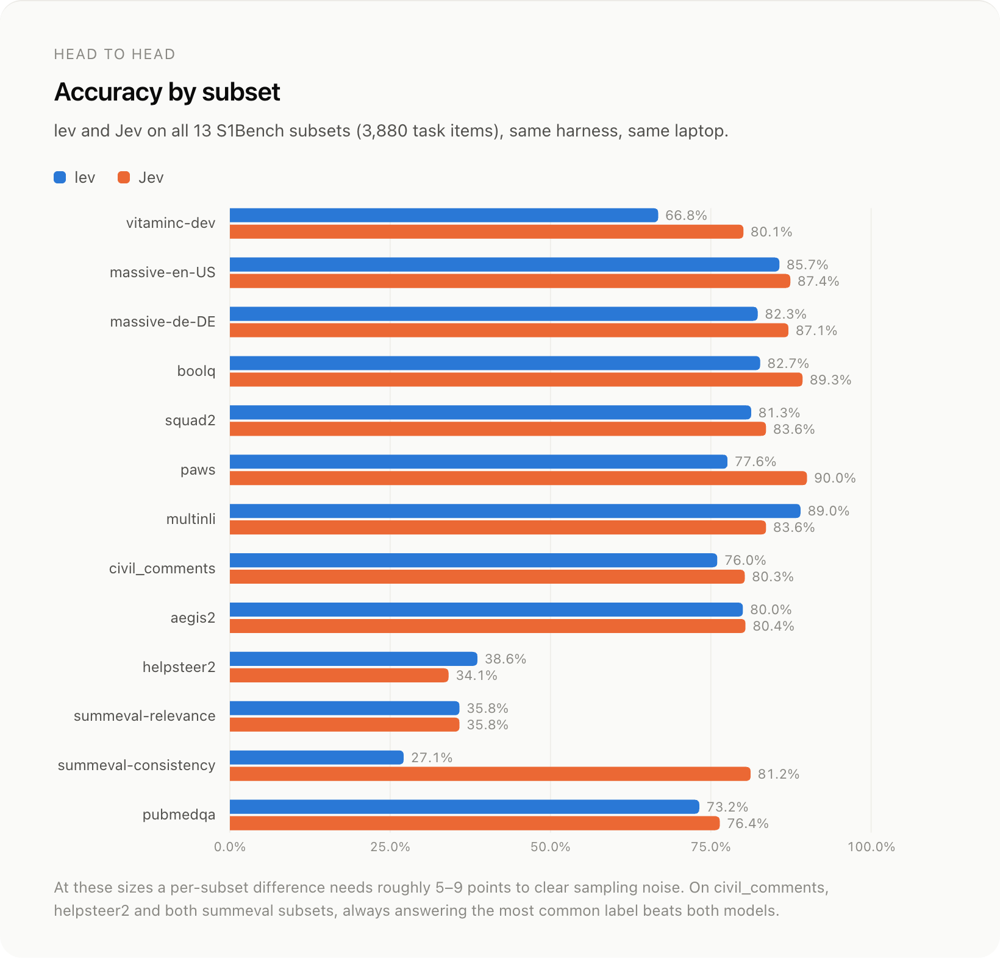
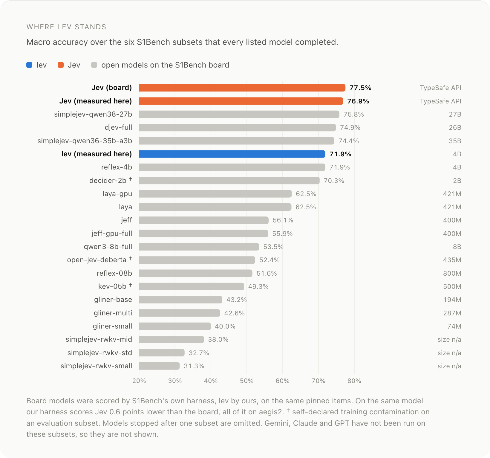
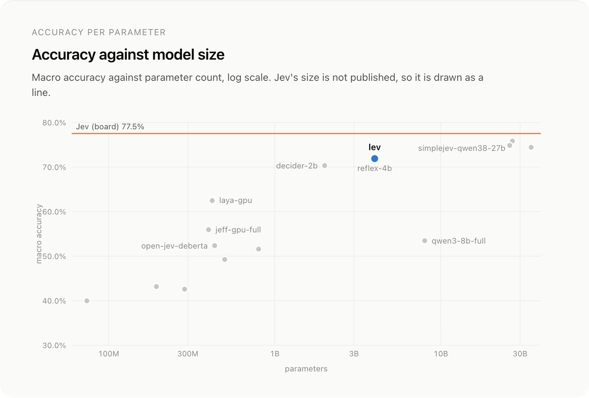
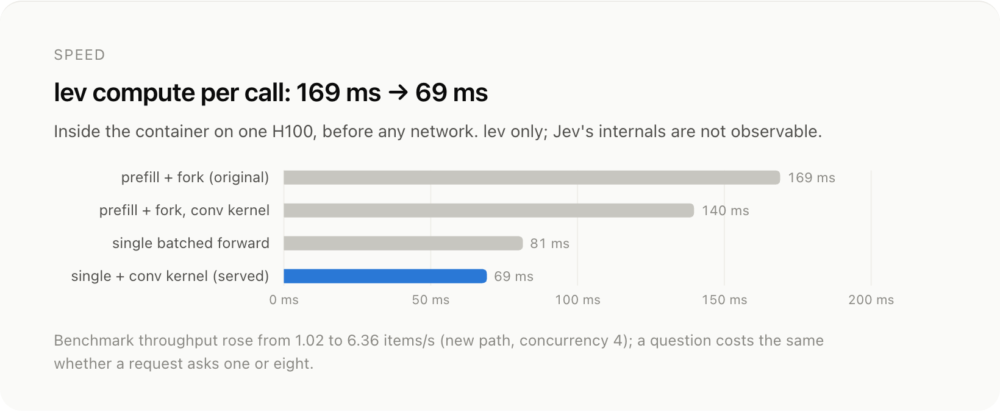
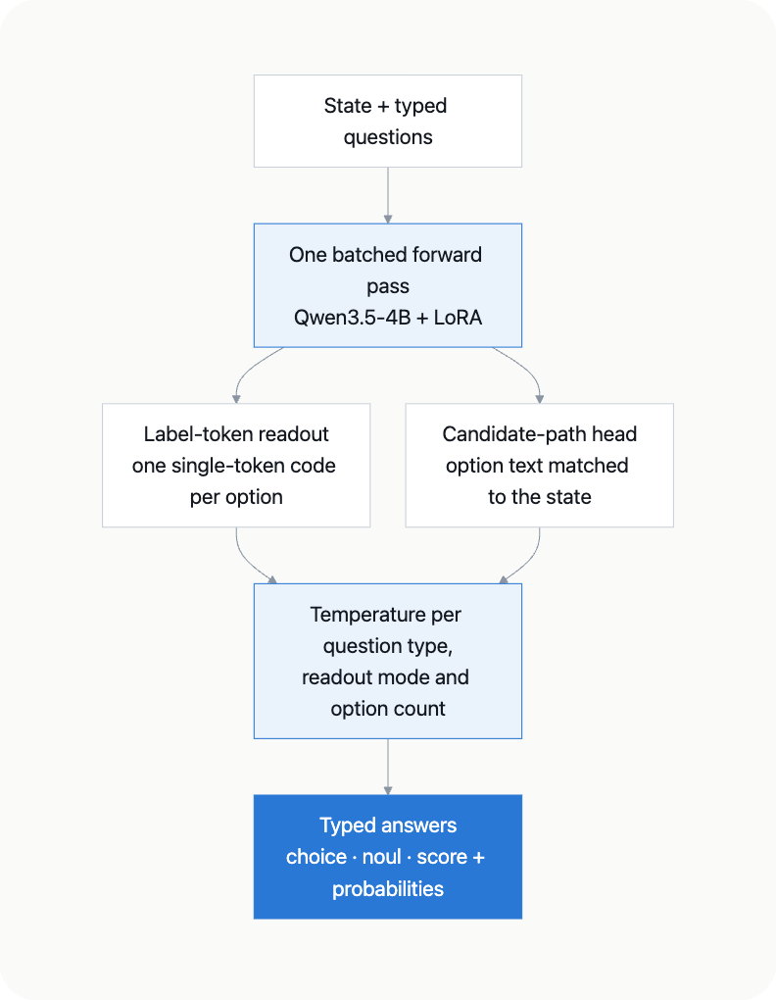

<p align="center">
  
</p>

lev answers typed questions about a piece of context in a single forward pass. You give it a **state** (text, a ticket, an email, or JSON) and a set of yes/no, choice, and score questions. It reads each answer from the logits it already computed and returns calibrated probabilities over exactly the options you supplied. It is a LoRA adapter on Qwen3.5-4B, and it speaks TypeSafe's `/v1/systemone` protocol, so code written for the TypeSafe SDK works against it once you change the base URL.

<div align="center" style="line-height: 1;">    <a href="https://github.com/Abhinavexists/lev"></a> <a href="https://interfaze.ai/blog/jev-now-open-source-lev"></a> <a href="https://interfaze.ai"></a></div>

<h2 align="center">68.9% on all 13 S1Bench subsets. 4B parameters. Zero output tokens.</h2>

<p align="center"><strong>Qwen3.5-4B + LoRA on one H100.</strong> On the six subsets the public S1Bench board completed, level with reflex-4b and behind only Jev and three open models of 26B–35B.</p>

<p align="center"><a href="#quickstart"><strong>Quickstart</strong></a> · <a href="#self-hosting-a-jev-compatible-http-server">Self-hosting</a> · <a href="#benchmarks">Benchmarks</a> · <a href="#speed">Speed</a> · <a href="#why-it-works">Why it works</a> · <a href="#training">Training</a> · <a href="#boundaries-worth-understanding">Boundaries</a> · <a href="https://github.com/Abhinavexists/lev">GitHub</a></p>

**No generated tokens, no JSON to parse, no retries.** lev cannot return a label outside your options, because the answer space is the option set you send. It can still pick the wrong option: the guarantee is structural, not a guarantee of correctness.

| Question | You give | You get |
| --- | --- | --- |
| `noul` | a yes/no question | `noul` = p(yes) |
| `choice` | instructions + options (name → description or `null`) | `choice`, `probabilities`, `confidence` |
| `score` | instructions + 2–10 ordered levels | `score` (expected level), `probabilities`, `confidence` |

It is built for the high-volume judgement calls inside a product: routing, moderation, intent detection, triage, grading, and checking LLM output.

## Installation

```bash
pip install "lev[serve] @ git+https://github.com/Abhinavexists/lev#subdirectory=packages/lev"
```

This needs Python 3.12 or newer and, for real-time use, a CUDA GPU. The `serve` extra installs torch, transformers, peft, and the HTTP server. The first load downloads the base model (Qwen/Qwen3.5-4B, about 8 GB) and this adapter (about 200 MB).

## Quickstart

```python
import lev

model = lev.load("interfaze-ai/lev")

state = "Hi, I was charged twice for my order #4471 and I want a refund."
questions = {
    "intent": {
        "type": "choice",
        "instructions": "What does the customer want?",
        "criteria": {
            "refund": "wants money back",
            "cancel": "wants to cancel an order",
            "track": "wants to know where an order is",
            "other": "anything else",
        },
    },
    "urgent": {"type": "noul", "instructions": "Does this need a human within the hour?"},
    "frustration": {
        "type": "score",
        "instructions": "How frustrated is the customer?",
        "criteria": ["calm", "mildly annoyed", "annoyed", "angry"],
    },
}

result = model.system_one(state, questions)
print(result.answers["intent"].choice)  # refund
print(result.answers["intent"].probabilities)
# {'refund': 0.84, 'cancel': 0.094, 'track': 0.012, 'other': 0.054}
print(result.answers["urgent"].noul)  # 0.43
print(result.answers["frustration"].score)  # 1.57, between "mildly annoyed" and "annoyed"
print(result.usage.output_tokens)  # 0
```

These are real outputs from this checkpoint. The answers are objects, and `result.model_dump()` gives the same JSON the HTTP server returns.

All the questions share one forward pass, so asking three questions costs about the same as asking one. `lev.load` reads `lev_release.json` from this repository to find the base model and the prompt format the adapter was trained with. It also applies the shipped calibration and loads the matching head, so there is nothing to configure.

Because the probabilities are calibrated, you can gate on them. For example, act automatically above 0.9 and send anything lower to a person.

## Self-hosting: a Jev-compatible HTTP server

```bash
lev serve --checkpoint interfaze-ai/lev --host 0.0.0.0 --port 8000
```

```bash
curl -s localhost:8000/v1/systemone -H 'content-type: application/json' -d '{
  "state": "The package arrived crushed and the screen is cracked.",
  "questions": {"damaged": {"type": "noul", "instructions": "Was the item damaged?"}}
}'
```

Existing TypeSafe clients work once you point them at the server:

```python
from typesafe_sdk import Choice, Noul, TypeSafeClient

# The first request after startup compiles kernels; allow more than the default 10 s.
client = TypeSafeClient(base_url="http://localhost:8000", api_key="local", timeout=60)
response = client.system_one(
    state={"ticket": "The app crashes every time I open settings."},
    questions={
        "team": Choice(
            instructions="Which team owns this?",
            criteria={"billing": "payments, refunds", "technical": "bugs, crashes", "other": None},
        ),
        "bug": Noul(instructions="Is this a bug report?"),
    },
)
print(response.answers["team"].choice, response.answers["bug"].noul)  # technical 0.92
```

`GET /health` reports the loaded checkpoint, whether calibration is active, and the routing settings. The server batches every question in a request into one forward pass, accepts concurrent requests, and returns 422 with the reason for a malformed question.

## Benchmarks

### S1Bench

<p align="center"></p>

| subset | task | **lev** | Jev | always the most common label |
| --- | --- | --: | --: | --: |
| vitaminc-dev | claim verification | 0.668 | **0.801** | 0.503 |
| massive-en-US | intent routing, 18 scenarios | 0.857 | **0.874** | 0.163 |
| massive-de-DE | intent routing, German | 0.823 | **0.871** | 0.163 |
| boolq | yes/no reading comprehension | 0.827 | **0.893** | 0.580 |
| squad2 | answerability | 0.813 | **0.836** | 0.502 |
| paws | adversarial paraphrase | 0.776 | **0.900** | 0.516 |
| multinli | natural language inference | **0.890** | 0.836 | 0.361 |
| civil_comments | toxicity | 0.760 | **0.803** | 0.893 |
| aegis2 | safety moderation | 0.800 | **0.804** | 0.568 |
| helpsteer2 | helpfulness, 5 levels | **0.386** | 0.341 | 0.422 |
| summeval-relevance | summary relevance, 5 levels | 0.358 | 0.358 | 0.458 |
| summeval-consistency | summary faithfulness, 5 levels | 0.271 | **0.812** | 0.840 |
| pubmedqa | biomedical yes/no/maybe | 0.732 | **0.764** | 0.532 |
| **macro** | | 0.689 | **0.761** | |

lev and TypeSafe Jev ran through the same harness on all 3,880 items S1Bench scores, pinned by [Nimble](https://github.com/bespokelabsai/nimble)'s manifests. Our Jev run lands within 0.8 points of TypeSafe's published figure on every subset, so the harness is not the gap.

- **Noise:** at these sizes a per-subset difference needs roughly 5–9 points to be real. lev's leads on multinli and helpsteer2 are inside that.
- **Where Jev is clearly ahead:** the minimal-edit pairs (paws −12.4, vitaminc −13.3) and summeval-consistency (−54.1), where lev rates most fully faithful summaries one level low. Fine-tuning introduced that: the untuned backbone scores 0.826.
- **Constant baselines:** on civil_comments (89% not toxic) and the three 5-level rating subsets, always answering the most common label beats both models.
- **Calibration:** mean ECE 0.115 for lev, 0.091 for Jev; lev is better calibrated on 5 of 13.

<p align="center"></p>

<p align="center"></p>

### Held-out split

A held-out split of the 29 training sources, with no row shared with training:

| metric | value |
| --- | --- |
| weighted accuracy | 0.807\* |
| expected calibration error | 0.061\* (0.180 before calibration) |
| banking77 (77 intents) | 0.980 |
| clinc_oos (151 intents) | 0.968 |
| FEVER claim verification | 0.872\* |

\* Measured on this checkpoint before the last serving update. That update routes choice sets of more than 68 options to label-token readout and re-selects the temperatures. The banking77 and clinc_oos rows come from after the update, which raised banking77 from 0.818. Smaller option sets are routed the same way as before.

### Speed

<p align="center"></p>

A call is one batched forward pass over every question, so compute stays flat from one question to eight, and a 60-option choice costs the same as a yes/no.

The 69 ms is engine compute for a short request (a three-sentence state), measured inside the container; S1Bench's longer states take more. End to end from a laptop, Jev's hosted API answered in 335–346 ms median and lev on one Modal H100 in 414–654 ms across two runs.

## Why it works

<p align="center"></p>

- **Label-token readout.** Each option gets a short code, and the answer is read from the next-token logits over those codes. Codes that would split into two tokens are skipped, so every option stays one token. This handles yes/no, scores, and choice lists up to several hundred options. Choices are read in two option orders and averaged, which cancels position bias.
- **Candidate-path head.** Past that point, a small learned head matches the state against each option's text, so the number of options has no fixed ceiling.
- **Calibration.** Temperatures fitted after training are applied at load time. There is one per question type, readout mode, and choice option-count band. They were selected by how well they carry over to task families left out of the fit, not only by how well they fit held-out rows.

### The optimizations that mattered

- **One batched forward instead of prefill-and-fork: 169 → 69 ms.** At this size the forward pass is bound by kernel launches, not arithmetic, so forking the cache saved FLOPs and cost time. One batched forward plus the depthwise-conv kernel cut compute by 59%. [ADR-023](https://github.com/Abhinavexists/lev/blob/main/docs/DECISIONS.md#adr-023--one-batched-forward-not-prefill-and-fork)
- **Label-token readout up to the tokenizer's limit: +51 points on MASSIVE's 60 intents.** Serving 60 options through label codes instead of the learned head took accuracy from 0.231 to 0.746. [ADR-025](https://github.com/Abhinavexists/lev/blob/main/docs/DECISIONS.md#adr-025--serving-routes-mode-a-up-to-the-tokenizer-limit-training-keeps-its-cap)
- **Skipping codes that split: banking77 0.818 → 0.980.** Passing over codes that tokenize to two tokens lifts label-token readout from 68 options to several hundred. [ADR-028](https://github.com/Abhinavexists/lev/blob/main/docs/DECISIONS.md#adr-028--skip-split-label-codes-when-serving-calibrate-for-families-the-model-has-not-seen)
- **The backbone's own prompt format: 0.653 → 0.710 frozen.** The untuned instruct model scored 5.7 points higher on the earlier six-subset S1Bench set when questions are dressed in its chat template, so the final run trained in that format. [ADR-027](https://github.com/Abhinavexists/lev/blob/main/docs/DECISIONS.md#adr-027--the-prompt-is-dressed-in-the-backbones-own-format)

## Training

- **Data:** 200,000 examples from 29 sources built on 26 public Hugging Face datasets. The tasks cover topic, sentiment, and emotion classification; intent detection (banking77, clinc_oos, snips); NLI (SNLI, ANLI, FEVER); paraphrase (MRPC, QQP, PARADE, plus word-swapped hard negatives); multiple-choice QA (RACE, ARC, SciQ, OpenBookQA, CommonsenseQA, StrategyQA); toxicity and safety (ToxiGen, ToxicChat, BeaverTails); and helpfulness (UltraFeedback). Questions are paraphrased, negated, and recast between types, and option sets are shuffled and resized, so the model learns the question format and not one wording.
- **Contamination guard:** the data build refuses any source that resolves to one of the 13 S1Bench subsets.
- **Recipe:** LoRA r=32, α=64 on the q/k/v/o attention and MLP projections; 3 epochs, 18,750 steps, batch size 32, learning rate 5e-5, in the base model's chat format, on one H100 in 7.8 hours.

## Boundaries worth understanding

- **Minimal edits and fine-grained ratings are weak.** Inputs that differ by one swapped word or number, and quality ratings over five levels, are where lev is least accurate and can be confidently wrong.
- **Calibration is fitted on the training distribution.** Temperatures are chosen to transfer across task families. Even so, a task very unlike the training mix may be less well calibrated. Check on your own data before you gate on the probabilities.
- **Questions are answered independently.** Answers in one request do not condition on each other. Encode a joint decision as one choice, or ask in stages.
- **English only.**
- **Needs a GPU for real-time use.** It runs on CPU, but a 4B backbone there takes seconds per call, not milliseconds.

## Hosted classification

Text classification in Interfaze runs on a similar system to lev: the model reads the answer from the set of labels you define. The difference is that Interfaze is still token based, so it's a hybrid.

| Item | lev | Interfaze |
| :-- | :-- | :-- |
| Output | Probabilities, zero output tokens | Tokens, returned as structured output |
| Questions | Typed only: yes/no, choice, score | Any JSON schema, labels included |
| In the same request | Classification only | OCR, web search, transcription, extraction, and more |
| Where it runs | Your GPU | Interfaze API |

Tokens cost a little speed, but they let one request classify a document while also reading, searching, and extracting from it. Define your labels as an enum in the schema, and the label comes back as a typed field.

**Interfaze docs → [interfaze.ai/docs](https://interfaze.ai/docs)**

## Files

| file | role |
| --- | --- |
| `adapter_model.safetensors`, `adapter_config.json` | LoRA adapter |
| `mode_b_head.pt` | candidate-path head (tensor state dict, loaded with `weights_only=True`) |
| `tokenizer*`, `chat_template.jinja` | the tokenizer that the label codes were verified against |
| `calibration.json` | fitted temperatures |
| `lev_release.json` | manifest: base model, prompt format, readout, training step |

## License

The adapter is released under Apache-2.0, the same license as the base model. Some of the training datasets have their own terms, including non-commercial licenses. Review them before commercial use.

Not affiliated with or endorsed by TypeSafe AI.

Apache 2.0 · Interfaze
